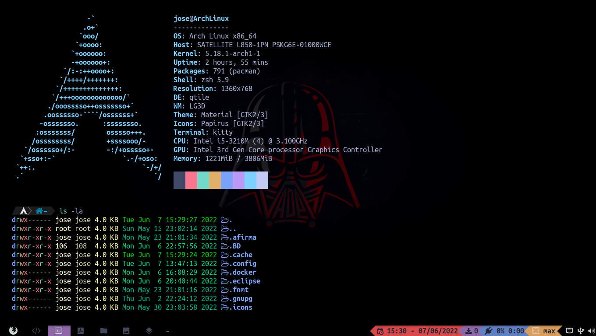

# Mi entorno de escriotiro Qtile con ArchLinux



# Tabla de contenidos
- [ArchLinux](#arch-linux)
  - [Instalacion de ArchLinux](#instalacion-de-archlinux)
    - [Conexion wifi](#conexion-wifi)
    - [Particiones y formato de disco](#particionar-y-formatear-el-disco)
    - [Instalar paquetes esenciales](#instalar-paquetes-esenciales)
    - [Instalacion del gestor de arranque](#instalacion-del-gestor-de-arranque)
    - [Antes de reiniciar](#antes-de-reiniar)
  - [Configuracion adicional de Arch Linux](#configuracion-adicional-de-arch-linux)
- [Qtile](#qtile)1
  - [Instalacion de Qtile](#instalacion-de-qtile)
  - [Instalacion paquetes necesarios para Qtile](#instalacion-paquetes-necesarios-para-qtile)
  - [Mi configuracion](#mi-configuracion)
  - [Configuración básica de Qtile](#configuración-básica-de-qtile)
  - [Utilidades básicas del sistema](#utilidades-básicas-del-sistema)
    - [Fondo de pantalla](#fondo-de-pantalla)
    - [Fuentes](#fuentes)
    - [Audio](#audio)
    - [Monitores](#monitores)
    - [Almacenamiento](#almacenamiento)
    - [Redes](#redes)
    - [Systray](#systray)
    - [Notificaciones](#notificaciones)
    - [Xprofile](#xprofile)
  - [Software](#software)
    - [Utilidades básicas](#utilidades-básicas)
    - [Fuentes, temas y GTK](#fuentes-temas-y-gtk)
    - [Apps](#apps-1)

# Enlaces a consultar
- **[Gnome-Look](https://www.gnome-look.org/s/Gnome/browse/)**
- **[Qtile docs](http://docs.qtile.org/en/stable/)**
- **[Nerd Fonts](https://www.nerdfonts.com/cheat-sheet)**
- **[Personalizar LightDM](https://geekland.eu/personalizar-y-configurar-lightdm/)**
- **[Instalar Docker](https://linuxhint.com/arch-linux-docker-tutorial/)**
- **[Problemas con las llaves](https://superlativoblog.wordpress.com/2017/01/06/solucion-al-problema-de-llaves-actualizando-arch-o-derivadas/)**

# Arch Linux

## Instalacion de ArchLinux 
Como la instalacion puede cambiar, lo mejor seria diriginos directamente a la [guide installation](https://wiki.archlinux.org/title/Installation_guide_(Espa%C3%B1ol)) y seguir paso a paso la guia de instalacion de archlinux  

Es posible que nos salga el tamaño de fuente demasiado pequeño, por ahora podemos configurar esto con este comando
```bash
setfont ter-118n
```

### Conexion wifi
```bash
iwctl
```
```bash
station wlan0 scan       
```
```bash
station wlan0 get-networks
```
```bash
station wlan0 connect SSID
```

### Particionar y formatear el disco
Usaremos cfdisk por su comodidad
```bash
cfdisk
```
Particionamos el disco usando cfdisk  
    - 150 MB - EFI SYSTEM  
    - 15 GB - SWAP  
    - RESTO - /  
podemos ver las particiones fuera de cfdisk con
```bash
lsblk
```
Formateamos la particion swap
```bash
mkswap /dev/sda2
```
```bash
swapon /dev/sda2
```
Formateamos las particiones: /
```bash
mkfs.ext4 /dev/sda3
```
Montamos los sistemas de archivos
```bash
mount /dev/sda3 /mnt
```
Montamos la particion de EFI 
```bash
mount --mkdir /dev/sda1 /mnt/boot
```

### Instalar paquetes esenciales
Algunos paquetes quizas no sean esenciales pero podemos aprovechar e instalarlos ya
```bash
pacstrap /mnt base linux linux-firmware networkmanager sudo grub efibootmgr nano iwd
```

### Instalacion del gestor de arranque
Procedemos con la configuracion del grub
COnfiguramos el grub
```bash
grub-install --target=x86_64-efi --efi-directory=/boot
```
```bash
grub-mkconfig -o /boot/grub/grub.cfg
```

### Antes de reiniar
Asegurarse de habilitar el servicio networkManager
```bash
systemctl enable NetworkManager
```
Una vez hecho esto ya podemos salir de la instalacion
```bash
exit
```
```bash
umount -R /mnt
```
Y reiniciamos el sistema, si nos sale el gestor de arranque de Arch habra salido todo bien
```bash
reboot
```

## Configuracion adicional de Arch Linux
Editamos el archivo hosts
```bash
nano /etc/hosts

127.0.0.1	localhost   
::1		    localhost    
127.0.1.1	ArchLinux.localhost	ArchLinux      
```
Creacion de un nuevo usuario
```bash
useradd -m jose
```
```bash
passwd jose
```
```bash
usermod -aG wheel,video,audio,storage jose
```
tendremos que configurar el archivo sudoers para poder ser root
```bash
nano /etc/sudoers
```
Para poder instalar entornos de escritorio necesitamos instalar xorg
```bash
sudo pacman -S xorg xorg-server
```
Ahora generamos nuestras carpetas personales básicas (Escritorio, Descargas, Música, Etc.).
Para esto instalamos la herramienta xdg-user-dirs:
```bash
sudo pacman -S xdg-user-dirs
```
Por ultimo lo ejecutamos para que nos genere nuestras carpetas.
```bash
xdg-user-dirs-update
```

# Qtile

## Instalacion de Qtile
Instalamos Qtile y el logging manager
```bash
sudo pacman -S qtile lightdm lightdm-gtk-greeter
```
```bash
systemctl enable lightdm
```
Al ejecutar Qtile no podremos abrir una terminal, ya que Qtile usa xterm, tendremos que modificar en Keys la terminal  

## Instalacion paquetes necesarios para Qtile
Instalacion de algunos paquetes basicos para Qtile
```bash
sudo pacman -S git base-devel pulseaudio pavucontrol xorg-xinit arandr kitty rofi feh picom volumeicon cbatticon udisks2 udiskie ntfs-3g vlc imv scrot unzip lxappearance wget network-manager-applet spotify-launcher ttf-dejavu ttf-liberation noto-fonts notification-daemon libnotify python-pip pacman-contrib bat lsd zsh
```
Instalacion del paquete yay, que nos permitira instalar otros paquetes que noe esten en pacman
```bash 
git clone https://aur.archlinux.org/yay.git
```
```bash
cd yay
```
```bash
makepkg -si
```
Una vez tengamos instalado yay, podremos instalar el resto de paquetes
```bash
yay -S brave-bin telegram-desktop-bin visual-studio-code-bin autofirma configuradorfnmt onedriver xfce4-power-manager nautilus gnome-disk-utility zsh-syntax-highlighting zsh-autosuggestions evince whatsapp-for-linux brightnessctl-git
```

## Mi configuracion
Si quereis tener la misma configuracion que uso
```bash
git clone git@github.com:jose-016al/Qtile.git
```
```bash
cd Qtile
```
Copiamos el directorio .config
```bash
cp -r .config ~/
```
Copiamos el archivo xsession para que los cambios sean permanentes
```bash
cp -r .xprofile ~/
```
Le damos permisos de ejecicion en caso de que no los tenga
```bash
chmod u+x .xprofile
```

## Configuración básica de Qtile

Ahora que estás dentro de Qtile, deberías conocer algunos de los atajos de
teclado que vienen por defecto.

                                    | Atajo                | Acción                              |
                                    | -------------------- | ----------------------------------- |
                                    | **mod + enter**      | abrir xterm                         |
                                    | **mod + k**          | ventana siguiente                   |
                                    | **mod + j**          | ventana anterior                    |
                                    | **mod + w**          | cerrar ventana                      |
                                    | **mod + [12345678]** | ir al espacio de trabajo [12345678] |
                                    | **mod + ctrl + r**   | reiniciar qtile                     |
                                    | **mod + ctrl + q**   | cerrar sesión                       |

Antes de hacer nada, si no tienes la distribución del teclado en inglés,
deberías cambiarla usando *setxkbmap*. Abre *xterm* con **mod + enter**, y
cambia la distribución a español:

```bash
setxkbmap es
```

Ten en cuenta que este cambio no es permanente, si reinicias el PC tendrás que
esribir el comando anterior de nuevo. Consulta [esta sección](#xprofile) para
hacer cambios permanentes o sigue el orden natural de esta guía si tienes
tiempo suficiente.

Por defecto, no hay menú, tienes que lanzar programas a través de *xterm*. En
este punto puedes instalar otro emulador de terminal si lo prefieres:

```bash
# Instala otro de tu preferencia
sudo pacman -S kitty
```

Abre el archivo de configuración de Qtile:

```bash
code ~/.config/qtile/config.py
```

Al principio, después de los imports, encontrarás una lista llamada *keys*, que
contiene la línea siguiente:

```python
Key([mod], "Return", lazy.spawn("xterm")),
```

Edítala para lanzar el emulador de terminal que has instalado:

```python
Key([mod], "Return", lazy.spawn("alacritty")),
```

Instala un menú como
**[dmenu](https://wiki.archlinux.org/index.php/Dmenu)**
o **[rofi](https://wiki.archlinux.org/index.php/Rofi)**:

```bash
sudo pacman -S rofi
```

Después añade atajos de teclado para el menú:

```python
Key([mod], "m", lazy.spawn("rofi -show run")),
Key([mod, 'shift'], "m", lazy.spawn("rofi -show")),
```

Reinicia Qtile con **mod + control + r**. Deberías poder abrir el menú y el
emulador de terminal usando los atajos de teclado que acabas de definir. Si has
instalado *rofi*, puedes cambiar su tema:

```bash
sudo pacman -S which
rofi-theme-selector
```

## Utilidades básicas del sistema

En esta sección vamos a ver algunos programas que casi todo el mundo necesita en
su sistema. Pero recuerda que los cambios que haremos no son permanentes,
[esta sección](#xprofile) describe cómo conseguir que lo sean.

### Fondo de pantalla

Lo primero es lo primero, tu pantalla se ve negra y vacía, así que probablemente
quieras un fondo más bonito para no sentirte tan deprimido. Puedes abrir
*firefox* usando *rofi* y descargar un fondo de pantalla. Después instala
**[feh](https://wiki.archlinux.org/index.php/Feh)** o
**[nitrogen](https://wiki.archlinux.org/index.php/Nitrogen)**
y pon tu fondo:

```bash
sudo pacman -S feh
feh --bg-scale ruta/al/fondo/de/pantalla
```

### Fuentes

Las fuentes en Arch son básicamente un meme, antes de que te den problemas
puedes simplemente instalar estos paquetes:

```bash
sudo pacman -S ttf-dejavu ttf-liberation noto-fonts
```

Para listar todas las fuentes disponibles:

```bash
fc-list
```

### Audio

En este punto, no hay audio, necesitamos
**[pulseaudio](https://wiki.archlinux.org/index.php/PulseAudio)**.
Recomiendo instalar un programa gráfico para manejar el audio como
**[pavucontrol](https://www.archlinux.org/packages/extra/x86_64/pavucontrol/)**,
porque todavía no tenemos atajos de teclado para ello.

```bash
sudo pacman -S pulseaudio pavucontrol
```
En Arch,
[pulseaudio está activado por defecto](https://wiki.archlinux.org/index.php/PulseAudio#Running),
pero puede que tengas que reiniciar para que *pulseaudio* arranque. Después de
reiniciar, abre *pavucontrol* usando *rofi*, activa el audio (porque está en
"mute") y debería estar todo correcto.

Ahora puedes establecer atajos de teclado para *pulseaudio*, abre el archivo de
configuración de Qtile y añade esto:


```python
# Volumen
Key([], "XF86AudioLowerVolume", lazy.spawn(
    "pactl set-sink-volume @DEFAULT_SINK@ -5%"
)),
Key([], "XF86AudioRaiseVolume", lazy.spawn(
    "pactl set-sink-volume @DEFAULT_SINK@ +5%"
)),
Key([], "XF86AudioMute", lazy.spawn(
    "pactl set-sink-mute @DEFAULT_SINK@ toggle"
)),
```

Aunque para una mejor experiencia en la línea de comandos, recomiendo usar
**[pamixer](https://www.archlinux.org/packages/community/x86_64/pamixer/)**:

```bash
sudo pacman -S pamixer
```

Con ello puedes convertir los atajos de teclado en:

```python
# Volumen
Key([], "XF86AudioLowerVolume", lazy.spawn("pamixer --decrease 5")),
Key([], "XF86AudioRaiseVolume", lazy.spawn("pamixer --increase 5")),
Key([], "XF86AudioMute", lazy.spawn("pamixer --toggle-mute")),
```

Reinicia Qtile con **mod + control + r** y prueba los atajos. Si estás en un
portátil, probablemente también necesites controlar el brillo de tu pantalla,
para ello recomiendo
**[brightnessctl](https://www.archlinux.org/packages/community/x86_64/brightnessctl/)**:

```bash
sudo pacman -S brightnessctl
```

Puedes añadir estos atajos y volver a reiniciar Qtile:

```python
# Brillo
Key([], "XF86MonBrightnessUp", lazy.spawn("brightnessctl set +10%")),
Key([], "XF86MonBrightnessDown", lazy.spawn("brightnessctl set 10%-")),
```

### Monitores

Si tienes múltiples monitores, seguramente quieras usarlos todos. Así es como
funciona **[xrandr](https://wiki.archlinux.org/index.php/Xrandr)**:

```bash
# Lista todas las salidas y resoluciones disponibles
xrandr
# Formato común para un portátil con monitor extra
xrandr --output eDP-1 --primary --mode 1920x1080 --pos 0x1080 --output HDMI-1 --mode 1920x1080 --pos 0x0
```

Es necesario especificar la posición de cada salida, si no se utilizará 0x0, y
todas las salidas estarán solapadas. Ahora bien, si no quieres calcular píxeles
y demás necesitas una interfaz gráfica como
**[arandr](https://www.archlinux.org/packages/community/any/arandr/)**:

```bash
sudo pacman -S arandr
```

Ábrela con *rofi*, ordena las pantallas como quieras, y después puedes guardar
la disposición de las mismas, lo cual simplemente te dará un script con el
comando exacto de *xrandr* que necesitas. Guarda ese script, pero todavía no
le des al botón de aplicar.

Para un sistema con múltiples monitores deberías crear una instancia de *Screen*
por cada uno de ellos en la configuración de Qtile.

Encontrarás una lista llamada *screens* en la configuración de Qtile que
contiene solo un objeto inicializado con una barra en la parte de abajo.
Dentro de esa barra puedes ver los widgets con los que viene por defecto.

Añade tantas pantallas como necesites y copia-pega los widgets, más adelante
podrás personalizarlos. Ahora puedes volver a *arandr*, darle click en "apply"
y reiniciar el gestor de ventanats.

Con esto tus monitores deberían funcionar.

### Almacenamiento

Otra utilidad básica que podrías necesitar es montar de forma automática
unidades de almacenamiento externas. Para ello uso
**[udisks](https://wiki.archlinux.org/index.php/Udisks)**
y **[udiskie](https://www.archlinux.org/packages/community/any/udiskie/)**.
*udisks* es una dependencia de *udiskie*, así que solo instalaremos este
último. Instala también el paquete
**[ntfs-3g](https://wiki.archlinux.org/index.php/NTFS-3G)**
para leer y escribir en discos NTFS:

```bash
sudo pacman -S udiskie ntfs-3g
```

### Redes

Hemos configurado la red a través de *nmcli*, pero un programa gráfico es más
cómodo. Yo uso
**[nm-applet](https://wiki.archlinux.org/index.php/NetworkManager#nm-applet)**:

```bash
sudo pacman -S network-manager-applet
```

### Systray

Por defecto, tenemos una "bandeja del sistema" en Qtile, pero no hay nada
ejecutándose en ella. Puedes lanzar los programas que acabamos de instalar así:

```bash
udiskie -t &
nm-applet &
```

Ahora deberías ver unos iconos en la barra, puedes clicar en ellos para
configurar la red y discos. Puedes instalar también iconos para la batería y
el volumen:

```bash
sudo pacman -S volumeicon cbatticon
volumeicon &
cbatticon &
```

### Notificaciones

Me gusta tener notificaciones en el escritorio también, para ello tienes que
instalar
[**libnotify**](https://wiki.archlinux.org/index.php/Desktop_notifications#Libnotify)
y [**notification-daemon**](https://www.archlinux.org/packages/community/x86_64/notification-daemon/):

```bash
sudo pacman -S libnotify notification-daemon
```

En nuestro caso,
[esto es lo que tenemos que hacer para tener notificaciones](https://wiki.archlinux.org/index.php/Desktop_notifications#Standalone):

```bash
# Crea este fichero con nano o vim
sudo nano /usr/share/dbus-1/services/org.freedesktop.Notifications.service
# Pega estas líneas
[D-BUS Service]
Name=org.freedesktop.Notifications
Exec=/usr/lib/notification-daemon-1.0/notification-daemon
```

Pruébalo:

```bash
notification-send "Hola Mundo"
```

### Xprofile

Como he mencionado antes, estos cambios no son permanentes. Para que lo sean
necesitamos un par de cosas. Primero instala
**[xinit](https://wiki.archlinux.org/index.php/Xinit)**:

```bash
sudo pacman -S xorg-xinit
```

Ahora puedes usar *~/.xprofile* para lanzar programas antes de que se ejecute
el gestor de ventanas:

```bash
touch ~/.xprofile
```

Por ejemplo, si escribes esto en tu *~/.xprofile*:

```bash
xrandr --output eDP-1 --primary --mode 1920x1080 --pos 0x1080 --output HDMI-1 --mode 1920x1080 --pos 0x0 &
setxkbmap es &
nm-applet &
udiskie -t &
volumeicon &
cbatticon &
```

Cada vez que inicias sesión tendrás los iconos de la bandeja del sistema, tu
distribución de teclado y monitores configurados.

## Software

### Utilidades básicas

| Software                                                                                            | Utilidad                                      |
| --------------------------------------------------------------------------------------------------- | --------------------------------------------- |
| **[networkmanager](https://wiki.archlinux.org/index.php/NetworkManager)**                           | Autoexplicativo                               |
| **[network-manager-applet](https://wiki.archlinux.org/index.php/NetworkManager#nm-applet)**         | *NetworkManager* systray                      |
| **[pulseaudio](https://wiki.archlinux.org/index.php/PulseAudio)**                                   | Autoexplicativo                               |
| **[pavucontrol](https://www.archlinux.org/packages/extra/x86_64/pavucontrol/)**                     | *pulseaudio* GUI                              |
| **[pamixer](https://www.archlinux.org/packages/community/x86_64/pamixer/)**                         | *pulseaudio* CLI                              |
| **[brightnessctl](https://www.archlinux.org/packages/community/x86_64/brightnessctl/)**             | Brillo para portátiles                        |
| **[xinit](https://wiki.archlinux.org/index.php/Xinit)**                                             | Inicia programas antes del gestor de ventanas |
| **[libnotify](https://wiki.archlinux.org/index.php/Desktop_notifications)**                         | Notificaciones de escritorio                  |
| **[notification-daemon](https://www.archlinux.org/packages/community/x86_64/notification-daemon/)** | Autoexplicativo                               |
| **[udiskie](https://www.archlinux.org/packages/community/any/udiskie/)**                            | Montar discos automáticamente                 |
| **[ntfs-3g](https://wiki.archlinux.org/index.php/NTFS-3G)**                                         | Leer y escribir NTFS                          |
| **[arandr](https://www.archlinux.org/packages/community/any/arandr/)**                              | GUI para *xrandr*                             |
| **[cbatticon](https://www.archlinux.org/packages/community/x86_64/cbatticon/)**                     | Systray para la batería                       |
| **[volumeicon](https://www.archlinux.org/packages/community/x86_64/volumeicon/)**                   | Systray para el volumen                       |
| **[glib2](https://www.archlinux.org/packages/core/x86_64/glib2/)**                                  | Basura                                        |
| **[gvfs](https://www.archlinux.org/packages/extra/x86_64/gvfs/)**                                   | Basura para GUIs                              |

### Fuentes, temas y GTK

| Software                                                                               | Utilidad                               |
| -------------------------------------------------------------------------------------- | -------------------------------------- |
| **[Picom](https://wiki.archlinux.org/index.php/Picom)**                                | Compositor para Xorg                   |
| **[UbuntuMono Nerd Font](https://aur.archlinux.org/packages/nerd-fonts-ubuntu-mono/)** | Nerd Font para iconos                  |
| **[Material Black](https://www.gnome-look.org/p/1316887/)**                            | Tema e iconos para GTK                 |
| **[lxappearance](https://www.archlinux.org/packages/community/x86_64/lxappearance/)**  | GUI para cambiar temas                 |
| **[nitrogen](https://wiki.archlinux.org/index.php/Nitrogen)**                          | GUI para establecer fondos de pantalla |
| **[feh](https://wiki.archlinux.org/index.php/Feh)**                                    | CLI para establecer fondos de pantalla |

### Apps

| Software                                                              | Utilidad                           |
| --------------------------------------------------------------------- | ---------------------------------- |
| **[alacritty](https://wiki.archlinux.org/index.php/Alacritty)**       | Emulador de Terminal               |
| **[thunar](https://wiki.archlinux.org/index.php/Thunar)**             | Gestor de archivos gráfico         |
| **[ranger](https://wiki.archlinux.org/index.php/Ranger)**             | Gestor de archivos de terminal     |
| **[neovim](https://wiki.archlinux.org/index.php/Neovim)**             | Editor de texto basado en terminal |
| **[rofi](https://wiki.archlinux.org/index.php/Rofi)**                 | Menú y navegación                  |
| **[scrot](https://wiki.archlinux.org/index.php/Screen_capture)**      | Captura de pantalla                |
| **[redshift](https://wiki.archlinux.org/index.php/Redshift)**         | Cuida tus ojos                     |
| **[trayer](https://www.archlinux.org/packages/extra/x86_64/trayer/)** | Systray                            |
