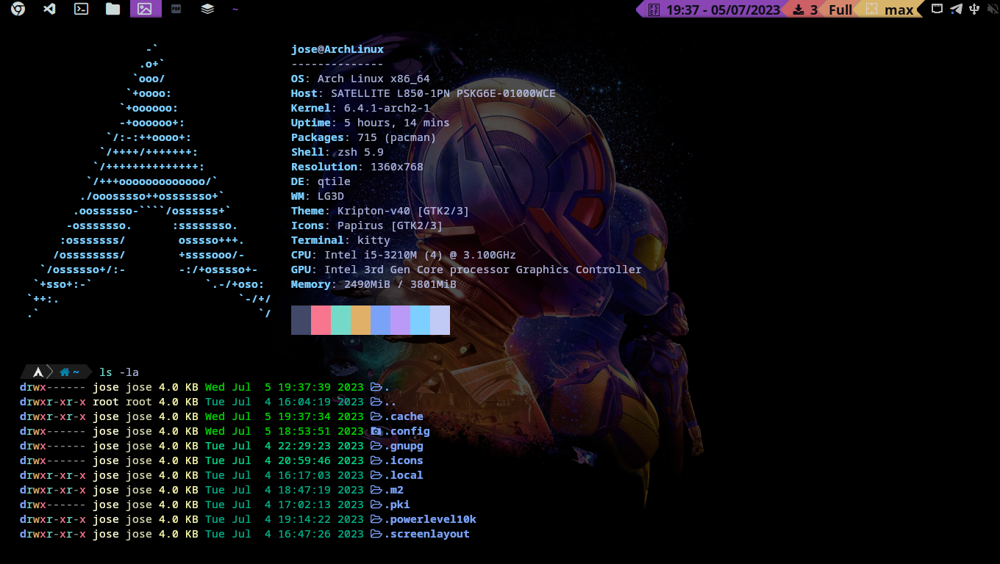

# Mis configuraciones de Qtile



# Índice

- [Instalacion de Arch Linux](#instalacion-de-arch-linux)

# Instalacion de Arch Linux

Para la instalacion de Arch Linux es recomendable, tener a mano la **[Wiki de Arch](https://wiki.archlinux.org/index.php/Installation_guide)**

#### Cambiamos la distribucion del teclado 
```bash
loadkeys es
```
Nos aseguramos de tener acceso a internet, ya sea por LAN, si no es el caso ejecutamos los siguientes comandos
```bash
iwctl...
```
#### 
```bash

```
####
```bash

```
####
```bash

```
####
```bash

```
####
```bash

```
####
```bash

```
####
```bash

```
####
```bash

```
####
```bash

```
####
```bash

```
####
```bash

```
####
```bash

```
####
```bash

```
####
```bash

```
####
```bash

```
####
```bash

```
####
```bash

```
####
```bash

```
####
```bash

```
####
```bash

```
####
```bash

```
####
```bash

```
####
```bash

```
####
```bash

```
####
```bash

```
####
```bash

```
####
```bash

```
####
```bash

```
####
```bash

```
####
```bash

```
####
```bash

```
####
```bash

```
####
```bash

```
####
```bash

```
####
```bash

```
####
```bash

```
####
```bash

```
####
```bash

```
####
```bash

```
####
```bash

```
####
```bash

```
####
```bash

```
####
```bash

```
####
```bash

```
####
```bash

```
####
```bash

```
####
```bash

```
####
```bash

```
####
```bash

```
####
```bash

```
####
```bash

```
####
```bash

```
####
```bash

```
####
```bash

```
####
```bash

```
####
```bash

```
####
```bash

```
####
```bash

```
####
```bash

```
####
```bash

```
####
```bash

```
####
```bash

```
####
```bash

```
####
```bash

```
####
```bash

```
####
```bash

```
####
```bash

```
####
```bash

```
####
```bash

```
####
```bash

```
####
```bash

```
####
```bash

```
####
```bash

```
####
```bash

```
####
```bash

```
####
```bash

```
####
```bash

```
####
```bash

```
####
```bash

```
####
```bash

```
####
```bash

```
####
```bash

```

# Tras la instalacion de Arch Linux
#### paquetes necesarios
```bash
sudo pacman -S 
```


#### Ahora para nuestras carpetas personales básicas (Escritorio, Descargas, Música, Etc.).
#### Para esto instalamos la herramienta xdg-user-dirs:
```bash
sudo pacman -S xdg-user-dirs
```
#### Por ultimo lo ejecutamos para que nos genere nuestras carpetas.
```bash
xdg-user-dirs-update
```

